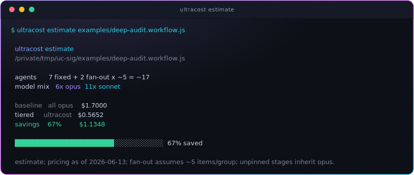

# Cost estimate, dynamic effort, and the pre-flight gate

ultracost does three things beyond routing: it **estimates** the cost of a workflow
before it runs, it has Claude pick a **per-stage effort** level, and it puts a
**pre-flight gate** in front of a workflow launch so you can approve, cancel, or
restructure it.

## `ultracost estimate <script>`

Static analysis (the same parser as `check`) reads every `agent()` stage, its pinned
`model` and `effort`, and whether it is a fan-out, then prices it.

<div align="center">



</div>

- **baseline** = every stage on the session model (opus @ xhigh) — what an unguided
  ultracode run does.
- **tiered** = the per-stage `model` + `effort` actually pinned. Unpinned stages
  inherit the session model, so they contribute **no** savings (a built-in incentive
  to pin them).
- `--json` emits the full breakdown for CI or tooling.

### The cost model (and its assumptions)

`cost(stage) = inputTokens/1e6 * price.input + outputTokens * effortMultiplier / 1e6 * price.output`

Defaults (all editable in `policy.json` under `estimation`):

- `tokensPerStage`: `{ input: 2000, output: 1200 }`
- `effortOutputMultiplier`: `low 0.4, medium 1, high 1.8, xhigh 3, max 4`
- `assumedFanout`: `5` (items per fan-out group, since the real count is a runtime value)

These are deliberately simple per-stage assumptions, **not** a measured token count.
Treat the dollar figures as relative estimates (tiered vs baseline), not a bill. The
savings **percentage** is robust to the absolute token assumption; the absolute dollars
scale with it.

## Pricing is official-sourced and refreshable

Prices live in `policy.json` under `pricing`, with provenance:

```json
"pricing": {
  "_source": "https://platform.claude.com/docs/en/about-claude/pricing.md",
  "_asOf": "2026-06-13",
  "_models": { "opus": "Claude Opus 4.8", "sonnet": "Claude Sonnet 4.6", "haiku": "Claude Haiku 4.5" },
  "opus":   { "input": 5, "output": 25 },
  "sonnet": { "input": 3, "output": 15 },
  "haiku":  { "input": 1, "output": 5 }
}
```

The committed numbers are a snapshot of Anthropic's official pricing page. Refresh them
any time:

```text
ultracost pricing            # show current prices + source + as-of date
ultracost pricing refresh    # fetch the official page, parse, and update policy.json
```

The estimate reads prices from `policy.json` (offline, deterministic) — there is **no**
network call on the estimate hot path, so it works in CI and offline. `refresh` is the
only command that reaches the network, and only when you run it. Bump the model version
strings in `_models` when a new model ships, then `refresh`.

## Dynamic per-stage effort

Each stage also gets an `effort`, chosen as the **lowest level that fits**, bounded by
the model (`sonnet` up to `high`, `opus` up to `xhigh`):

| effort | use for |
|--------|---------|
| `low`    | trivial deterministic work: listing/globbing, simple extraction, formatting |
| `medium` | light judgment on a small surface: a single straightforward edit, summarizing one source |
| `high`   | standard coding/analysis: most refactors, per-file review, non-trivial tests |
| `xhigh`  | hard reasoning: cross-file architecture, adversarial review, planning, final synthesis |

Effort feeds the estimate (higher effort = more output tokens = more cost), so dialing a
mechanical stage down to `low` is visible savings.

## The pre-flight gate (approve / cancel / modify)

Before launching a workflow, the injected policy has Claude: draft the script, run
`ultracost estimate` on it, then use the **AskUserQuestion** tool to offer three
options — **Approve** (launch), **Cancel** (don't), **Modify** (restructure to cut cost,
re-estimate, ask again).

The deterministic `PreToolUse` gate (`templates/hooks/workflow-gate.mjs`) implements this
decision, independent of whether the model asks:

<div align="center">


</div>

### Two gate mechanisms, and an honest limitation

1. **Deterministic `PreToolUse` gate (default, hard).** `templates/hooks/workflow-gate.mjs`
   is registered by the plugin (`hooks/hooks.json`) on the `Workflow` tool. It runs the
   static guard **and** the cost estimate on the drafted script, then returns a permission
   decision so **every** workflow launch pauses with the numbers — independent of whether
   the model decides to ask. This is the enforcement layer.
   - **Where you see the number.** The gate emits the estimate as a top-level
     `systemMessage` (the documented hook→user channel) **and** as the
     `permissionDecisionReason`. The `systemMessage` is what reliably renders: Claude Code
     currently does **not** display the `permissionDecisionReason` for an `"ask"` decision
     in the TUI ([anthropics/claude-code#24059](https://github.com/anthropics/claude-code/issues/24059)),
     so without `systemMessage` the cost would be computed but invisible. For `strict`/`deny`
     the reason renders too. The native "Run a dynamic workflow?" confirmation is Claude
     Code's own dialog — the ultracost line appears as a system message around it, not inside it.
   - **It leads with the problem.** If any stage is unpinned/banned/`inherit`, the message
     opens with `⚠ ultracost: N/M stage(s) NOT pinned -> will inherit <session model>` before
     the estimate — so an accidental all-Opus fan-out is impossible to miss. (This is the
     exact failure a live test caught: a `pipeline(...)` build/verify/fix workflow where the
     model pinned *no* stage.)
   - **Mode-aware by default — hard in every permission mode.** A `PreToolUse` hook runs in
     *all* permission modes; bypass only auto-approves the `ask` path, while a `deny` is
     honored regardless of mode. The gate reads `permission_mode` from the event and adapts:

     | mode | clean (all pinned) | problem (unpinned/banned/`inherit`) |
     |---|---|---|
     | `default` / `acceptEdits` / `auto` | ask + estimate | **ask** + ⚠ warning (an ask surfaces here) |
     | `bypassPermissions` / `dontAsk` | ask + estimate | **deny** (an ask wouldn't pause, so block) |
     | `plan` | (a workflow doesn't launch in plan mode) | — |

   - **Env overrides (`ULTRACOST_GATE`):**
     - *unset* (default) — the mode-aware behavior above.
     - `strict` — **deny** on any problem in *every* mode; `ask` when all pinned.
     - `ask` — never escalate to deny; always `ask` (opt out of the mode-aware deny).
     - `off` — disable entirely, for non-interactive runs (`claude -p`, Auto Mode, CI),
       where an unanswered `ask` is denied (the gate fails closed). Disable it there on
       purpose rather than letting an unpriced fan-out through silently.
   - **Residual limitation:** Claude Code currently skips `PreToolUse` hooks for subagents
     dispatched under `bypassPermissions`
     ([anthropics/claude-code#43772](https://github.com/anthropics/claude-code/issues/43772)),
     so a nested agent there can evade the gate. The top-level `Workflow` launch is still gated.
2. **AskUserQuestion-mediated (nicer UX, model-driven).** Driven by the always-on
   `SessionStart` policy injection. This renders the arrow-key 3-option
   Approve/Cancel/Modify menu, but it is *model-mediated* — Claude runs it because the
   policy is in context. It only appears in an interactive session. The hard hook above
   is what guarantees a stop even when this is skipped.

A plugin hook **cannot** render a fully custom arrow-key menu directly — that is an open
Claude Code feature request
([anthropics/claude-code#52343](https://github.com/anthropics/claude-code/issues/52343)).
Hooks can only block, allow, or escalate to the built-in allow/deny prompt. The custom
3-option Approve/Cancel/Modify menu therefore comes from `AskUserQuestion`, which the
model invokes, rather than from the kernel. This is documented, not hidden.

## Covered cases

- Fixed stages, fan-out stages (`.map`/`.flatMap`/`Array.from` **and `pipeline(items, ...stages)`**,
  whose every stage runs once per item), nested `parallel([...])` thunks (fixed count),
  pinned and unpinned stages, banned/`inherit` models, and prompt text that literally
  contains `agent(` (ignored). See `tests/estimate.test.js`.

> `pipeline(items, ...stages)` is the Workflow API's per-item fan-out primitive — each
> stage's `agent()` runs once for every item in `items`. The guard and estimate treat
> those stages as fan-out (counted as `assumedFanout` each, like `.map`). This is the
> exact shape an `ultracode` build/verify/fix workflow takes, so without it the agent
> count and cost are badly under-reported.

## Limitations

- **Estimates, not bills.** Per-stage token counts are assumptions; the absolute dollars
  scale with them. The tiered-vs-baseline ratio is the trustworthy signal.
- **Fan-out is a range.** The real item count is a runtime value; the estimate uses
  `assumedFanout` and the total scales linearly with the real count.
- **Dynamic options** (`agent(task, opts)` where `opts` is a variable) can't be read
  statically — the guard reports `UC005` and the estimate treats the stage as unpinned.
- **The gate's pause needs a TUI; deny does not.** The hard `PreToolUse` gate is on by
  default. In interactive modes that surface an ask (`default`/`acceptEdits`/`auto`) it
  pauses with the estimate; in `bypassPermissions`/`dontAsk` it auto-escalates an unpinned
  workflow to a `deny` (honored in every mode). In non-interactive runs an unanswered `ask`
  is denied, so set `ULTRACOST_GATE=off` there. The 3-option AskUserQuestion menu needs a
  TUI session.

## The closed loop (calibration, reconcile, ledger, budget)

The estimate above is *static* — it runs before the workflow. Phase 2 closes the loop by
reading the workflow's real token usage back from local transcripts (offline) and feeding it
forward:

- **`ultracost reconcile [--last|<wfId>]`** matches a real run's per-stage token usage
  (`subagents/workflows/wf_*/agent-*.jsonl` + `journal.jsonl`) against the all-opus baseline,
  using cache-aware pricing (`estimation.cacheMultipliers`, default cache-read `0.1x` / cache-write
  `1.25x` input). Per-stage attribution is by file path + `isSidechain`/`agentId`, never `sessionId`
  (subagent files inherit the parent session id).
- **`ultracost calibrate`** turns those per-stage token sizes into a prior
  (`~/.claude/ultracost/calibration.json`), dropping outliers beyond `3x` / below `0.2x` the median.
  `estimate`, `explain`, `simulate`, and the gate use it automatically when present, replacing the
  flat `tokensPerStage` default with your measured numbers.
- **`ultracost usage`** reports real cost split across the main loop, plain subagents, and
  dynamic-workflow stages.
- **`ultracost ledger`** persists per-run savings (`~/.claude/ultracost/ledger.jsonl`, idempotent
  per workflow id) and reports the cumulative total versus all-opus.
- **Budget guard.** `budget.perRun` / `budget.perDay` make the `PreToolUse` gate **deny** a launch
  whose estimate would exceed the cap (per-day reads the ledger's spend for the current day).

All of this is offline and Claude-Code-only; nothing leaves the machine.

## Validation (live, multi-domain)

Drafted by Claude under the plugin across domains; each script guard-clean (every stage
pinned), with dynamic effort, then measured by `ultracost estimate`:

| Domain | stages (model @ effort) | est. baseline (all-opus) | est. tiered | savings |
|--------|--------------------------|--------------------------|-------------|---------|
| Code refactor | opus@xhigh, opus@high, opus@xhigh | $0.30 | $0.264 | 12% |
| Web research | opus@high, sonnet@medium, opus@xhigh | $0.30 | $0.188 | 37% |
| CSV data | sonnet@low, sonnet@high (fan-out), opus@xhigh | $0.70 | $0.305 | 56% |
| Docs gen | sonnet@low, opus@high, opus@xhigh | $0.30 | $0.177 | 41% |

Savings track how much of the work is mechanical/fan-out (droppable to sonnet + lower
effort) versus genuine reasoning that stays on opus — exactly as intended.
